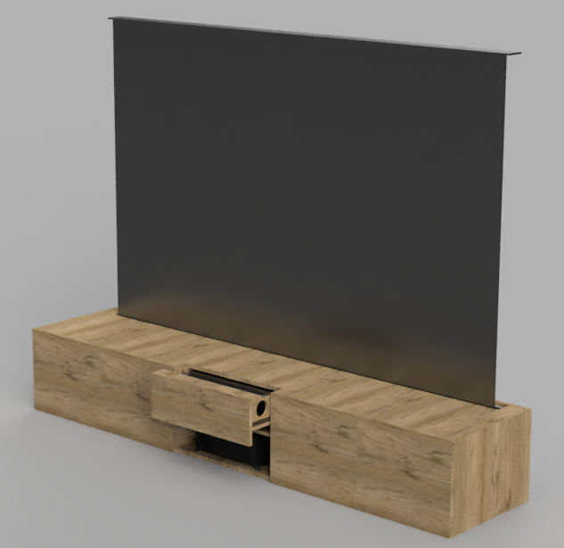
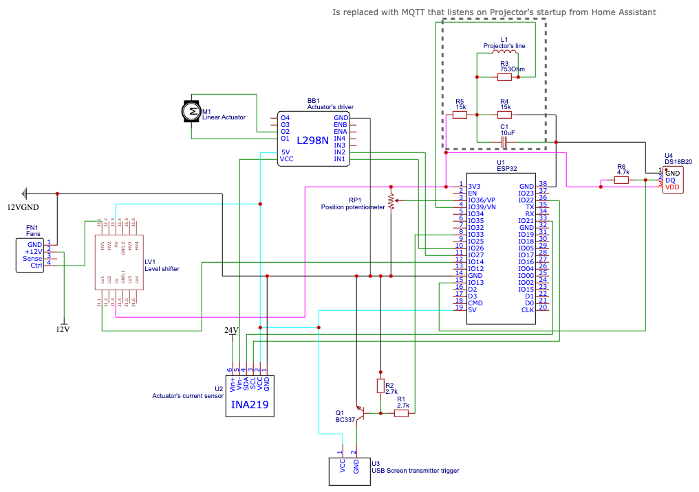
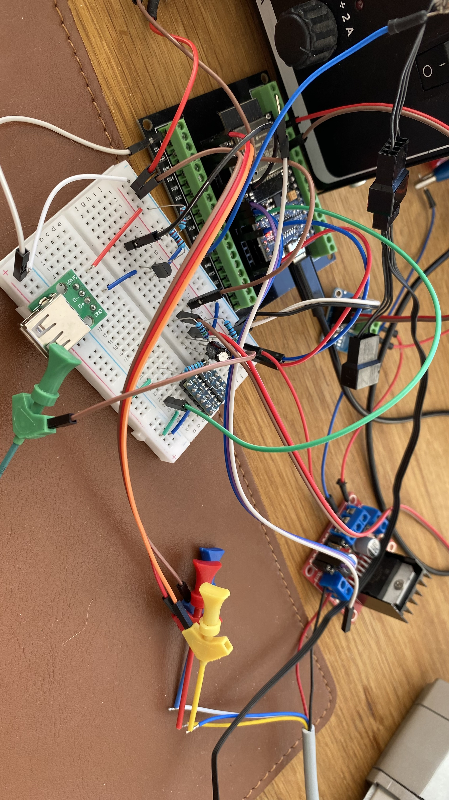
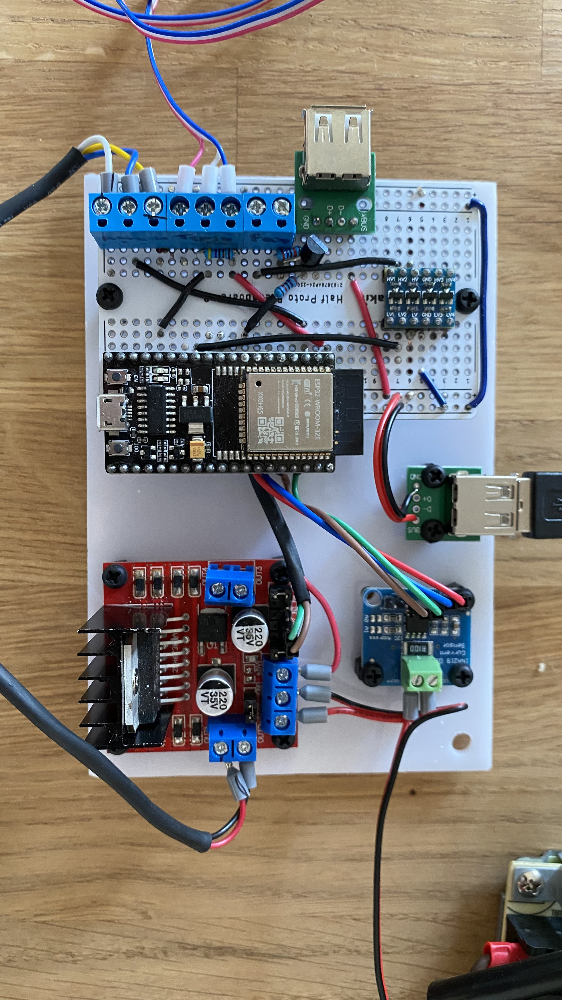
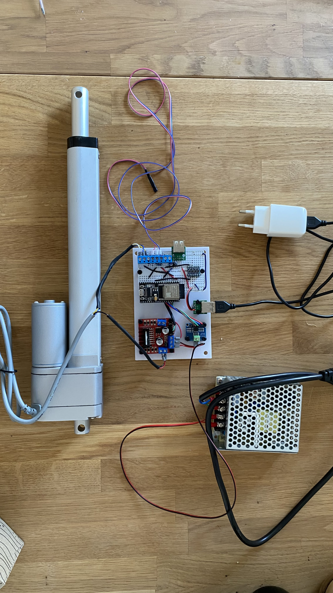
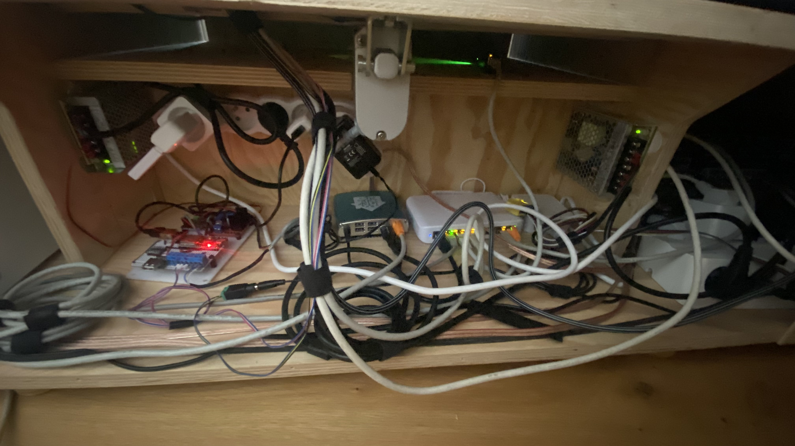

# UST Projector cabinet

> DIY "TV" cabinet project housing a hidden motorized screen and UST (ultra-short-throw) projector in motorized drawer.

[](https://www.youtube.com/watch?v=b7_Dzy0piuk)

## Features

 - "One-press" setup of the home cinema for watching
 - Home Assistant integration
 - Temperature sensor for monitoring the projector's temperature
 - Fans for cooling the projector
 - Collision monitoring of the drawer
 - OTA firmware updates
 - Remote logging to syslog target

## About the project

From my childhood I have dreamed of my own home cinema. About two years ago I have 
decided to embark on an adventure to slowly built it. Since we lived at that moment 
in small flat and planned to move some time soon, creating dedicated "room based" setup was not an 
option. It was around that time that I discovered Ultra Short Throw (UST) projectors
that would match all my requirements and slowly an idea started to grow in my head:

_What if I could place it into a cabinet and have very clean setup with all the components hidden when not using?_

And that is what I have started to work on over weekends and evenings for past 9 months.

Here I plan to share my final design and firmware code for anybody who would like to replicate (and possibly improve on) my work.
I won't be detailing it to the "step-by-step" guide, but leave resources here for people who
know what to do and how to do it.

**I have to warn you though. The project is very tailored to the specific components that I used and describe
later. Any deviation from those components require proper modification of other parameters!**

**Every centimeter makes big difference in the UST projector's screen size and position!**

## Components

 1. UST Projector: [Samsung LSP7T](https://www.samsung.com/uk/projectors/the-premiere/the-premiere-smart-4k-uhd-laser-projector-sp-lsp7tfaxxu/)
 1. Tensioned Floor Screen for UST projects: [Vividstorm S Pro 110"](https://www.vividstorm.eu/products/Vividstorm-S-Pro-110-Electric-Acoustically-Transparent-Floor-Screen-p298146472)
 1. AVR: [Denon X3800H](https://www.denon.com/en-us/product/av-receivers/avr-x3800h/300609-new.html) 
 1. Speakers: 5+1(subwoofer) + 2("Atmos" drivers) from JAMO S809 series
 1. Custom built cabinet from oak
 1. Linear actuator with potentiometer for positional feedback
 1. Control logic board with ESP32

### Cabinet

I am still novice when comes to wood working, so I have decided to leave the build of the
cabinet to my friend cabinetmaker. Therefore, I have design it and modeled it in Fusion 360 
as it was crucial to get the dimensions right because UST projector's viewports are very sensitive 
to any even small deviation and I wanted to obviously maximize the screen's utilization.

This is a render of the model: 

<a href="docs/img/render.png"></a>

You can find the Fusion model as file [here](docs/cabinet_model.f3z) or as online model [here](https://uhlir.autodesk360.com/g/shares/SH9285eQTcf875d3c5399135f607261bca4c).
But be aware it is not complete model that could be used as blueprint
for recreating the cabinet! It served more like a mock to understand the dimension requirements.

### Electronics

The brain of the cabinet is custom build circuit around ESP32. I have decided
to program its firmware with MicroPython as Python is close to my heart. The 
circuit serves as integration point of several things:

 - controlling the linear actuator that opens/closes the projector's cabinet
 - controlling USB radio stick of the motorized screen (it works in simple way, if there is power going to the stick than screen is opened, otherwise it closes)
 - controlling the additional PC Fans mounted in the back of the projector's cabinet as otherwise the projector overheats
 - exposing temperature information about the projector

Originally my design goal was to have self-contained circuit. Later on, I have
deviated from this goal as I have decided to scratch my original approach for 
triggering openning/closing the cabinet using monitoring of the AC power line
to the projector and doing decision based on the current passing through that line.

I have instead opted to expose the above functionalities as Home Assistant entities and use the Home Assistant integration to Samsung's Tizen 
that runs on the projector for triggering the proper actions. 
Unfortunately it is not so reliable as sometimes the events from Tizen are not triggered or are triggered multiple times.
I had version of the firmware that was ready for the current-sensing approach, so if you would be interested in that
have a look on [this commit](https://github.com/AuHau/projector-cabinet/commit/b25f13ab9c904240c6eca4cdfa69838080070a1d). 
But be aware even though it was functional, it was not properly tested and finished.

The final schema which includes also the component for measuring the projector's line current mentioned above is here:

<a href="docs/img/schema.png"></a>

You can download its export from EasyEDA [here](./docs/easda-schema.json).

Some pictures of prototyping and final assembly:

| <a href="docs/img/prototyping-done.jpeg"></a>           | <a href="docs/img/assambled-board.jpeg"></a>           | 
|---------------------------------------------------------------------------------------------------------------|-------------------------------------------------------------------------------------------------------------|
| <a href="docs/img/ready-to-be-installed.jpeg"></a> | <a href="docs/img/electronic-installed.jpeg"></a> |

## Home Assistant

This project heavily relies on Home Assistant for orchestration and integration. Bellow you can see the overview and
capabilities that are exposed over Home Assistant:

[](docs/img/homeassistant.png)

## Reproducing the project

As I said I won't provide "step-by-step" guideline here, but here are some pointers for reproducing this, mainly related
to firmware.

### Configuration

Fork this repo. The important configuration needs to be placed in `/app/secrets.py` file. This
file should not be commited (and is currently in `.gitignore`) as it contains sensitive configuration. This configuration
will be persisted over OTA updates. Content of this file shoudl be:

```python
# WiFi settings
WIFI_SSID = "" # YOUR WIFI NAME
WIFI_PASS = "" # YOUR WIFI PASSWORD

# MQTT settings
MQTT_BROKER = "" # NODE WHERE YOU RUN HOME-ASSISTANT'S MQTT
MQTT_USER = ""
MQTT_PASS = ""

# Syslog logging
SYSLOG_HOST = "" # NODE WHERE YOU RUN SYSLOG COLLECTOR
SYSLOG_PORT = ""
```

### OTA updates

OTA updates are sourced from GitHub Releases. For creating those there is Release-Please action which creates
Release PR that when you merge it create new release. For updating the firmware you need to press in Home Assistant
"Install" button on the Firmware entity.
